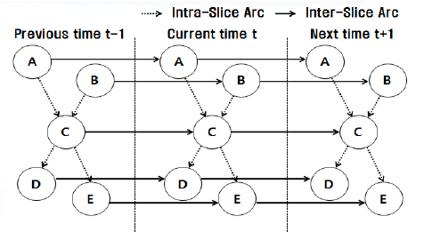

# Time series anomaly detection

## Overview
In `applybn` anomaly detection on time-series based on specific type of bayesian networks 
Dynamic Bayesian Networks. They are designed to work with time-series.



*Dynamic Bayesian Network Example. Source: [article](https://www.researchgate.net/figure/A-structure-of-dynamic-Bayesian-network_fig1_224246998)*

Learning of such networks is very consuming, so another approach from
[Outlier Detection for Multivariate Time Series Using Dynamic Bayesian Networks](https://www.mdpi.com/2076-3417/11/4/1955)
is used.

!!! warning

    Method implemented in `applybn` deals only with discrete **MTS** (Multivariate time series), so user must proceed them with 
    any discretization method (SAX, bin discretization, etc.).

## Mathematical Foundation
### Core Structure of Dynamic Bayesian Networks
A DBN extends a **Bayesian Network (BN)** by introducing **time** as an explicit variable. The key components are:  

#### Time Slices
A DBN consists of **repetitions of a base Bayesian Network** over discrete time steps ($t=0, t=1, ..., t=T$).
Each time slice contains the same variables but with evolving probabilities.  

#### Intra-Slice vs. Inter-Slice Dependencies
- **Intra-slice edges** (within a time step) model contemporaneous relationships (e.g., $X_t \rightarrow Y_t$).  
- **Inter-slice edges** (between time steps) model temporal dependencies (e.g., $X_t \rightarrow X_{t+1}$).  

#### 2-Time-Slice Bayesian Network (2-TBN)
A compact representation where the full DBN is "unrolled" from a **2-slice template**.  
Defines the transition model:  
  - **Prior Network ($t=0$)**: Initial state distribution.  
  - **Transition Network ($t \rightarrow t+1$)**: How variables evolve.  

---

### Key Assumptions in DBNs
#### Markov Assumption
- The future is independent of the past given the present:
  \( P(X_{t+1} | X_t, X_{t-1}, ..., X_0) = P(X_{t+1} | X_t) \)

- Higher-order dependencies can be modeled by increasing the Markov order.  

#### Stationarity (Time-Invariance)
- The transition probabilities ($P(X_{t+1}|X_t)$) do not change over time.  

#### Factored State Representation
- The system state is represented by multiple variables (e.g., $X_t, Y_t, Z_t$), each with its own dynamics.  

### Learning DBNs
#### Parameter Learning
Given a fixed structure, learn **CPTs** (Conditional Probability Tables) from data.  
Methods:  

  - Maximum Likelihood Estimation (MLE)
  - Bayesian Parameter Estimation (with Dirichlet priors)  

#### Structure Learning
Learn both the **inter-slice** and **intra-slice** dependencies.  
Methods:  

  - Score-based (BIC, AIC) 
  - Constraint-based (PC algorithm adapted for time)

#### Method in `applybn`
`applybn` implements different approach to structure learning. Instead of expensive computations, it utilizes 
algorithms for searching [minimum weight spanning tree](https://en.wikipedia.org/wiki/Minimum_spanning_tree).

It is defined as follows: 
> A minimum spanning tree (MST) or minimum weight spanning tree is a subset of the edges of a connected, 
> edge-weighted undirected graph that connects all the vertices together, 
> **without any cycles** and with the minimum possible total edge weight.
> -- <cite>Wikipedia</cite>

!!! warning

    For any bayesian network there are strict acyclicity constraint. If bayesian network has cycles, 
    definety something went wrong. 

This algorithm contains these steps:

1. Build complete graph of $m$ markov lag, bayesian networks in intra-slices are dense as well.
2. Computes weights for each edge with local LL, a quantity that measures how well the node's 
   conditional probability distribution fits the observed data, given its parents.

   **Initial time slice (\( t=0 \))** (same as static BN).

   \(\mathcal{L}_X^{(0)}(\theta_X | \mathcal{D}) = \sum_{i=1}^{N} \log P(X_0 = x_0^{(i)} | \text{Pa}(X_0) = \text{pa}_0^{(i)}, \theta_X)\)

   **Transition slices (\( t \geq 1 \))**. The log-likelihood for a node \( X \) at time \( t+1 \) depends on its parents at time \( t \).

\(
\mathcal{L}_X^{\text{trans}}(\theta_X | \mathcal{D}) = \sum_{t=0}^{T-1} \sum_{i=1}^{N} \log P(X_{t+1} = x_{t+1}^{(i)} | \text{Pa}(X_{t+1}) = \text{pa}_{t+1}^{(i)}, \theta_X)
\)

where:

- \( T \) - total time steps,
- $\mathcal{D}$ - dataset
- \( \text{Pa}(X_{t+1}) \) may include both **intra-slice** and **inter-slice** parents.
- $\theta_x$ - parameters of conditional distribution.

The parents were taken as:
>  <...> up to p parents from the previous m time
slices and the best parent from time slice t. 

Please notice that parents are taken as they appear in maximum branching algorithm.

After obtaining dense graph maximum branching algorithm is applied, and the result is structure for DBN.

For parameters estimation MLE is used.

## Anomaly detection with tDBN
There are several ways to detect anomalies from scores. Consider a dataset with shape (1000, 56) and 
a score matrix with size (10, 1000), 
where 10 is a number of transition and 1000 number of subjects. For each transition there are a measures of 
abnormality (e.g. first element contains abnormality in transition from $X$ tp $X_{t + 1}$).

These scores can be thresholded by `abs_threshold` and `rel_threshold`. The former create a binary matrix with
shape (10, 1000).Then the `rel_threshold` (a number between 0 and 1) shows how many times a subject show anomaly 
behaviour and from which fraction anomaly is considered.

!!! note

    You can increase sensivity by increasing `rel_threshold` and decreasing `abs_threshold`.


## Data format specification
In order to use [`FastTimeSeriesDetector`](../../api/anomaly_detection/ts_anomaly_detection.md) your data must have 
the following format:

```
    subject_id f1__0  f2__0  f1__1  f2__1
        0        0      10     1      11
        1        1      11     2      12
```

where 

- subject_id is a distinct subject (can be sensors, people etc.). 
- Each column is a feature a time slice named feature_name__index (`__` presence is mandatory!).

### Example

``` py title="examples/anomaly_detection/time_series.py"
--8<-- "examples/anomaly_detection/time_series.py"
```