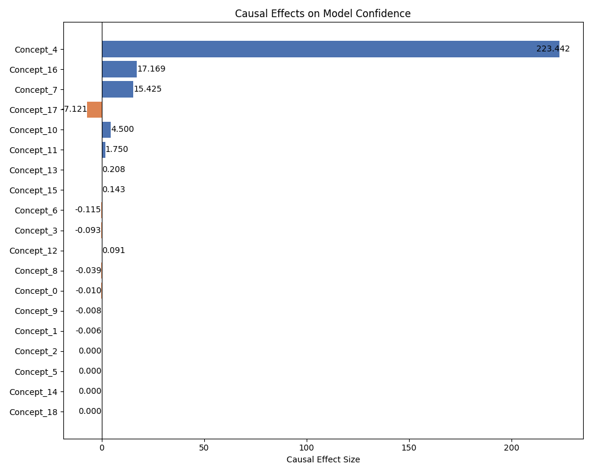
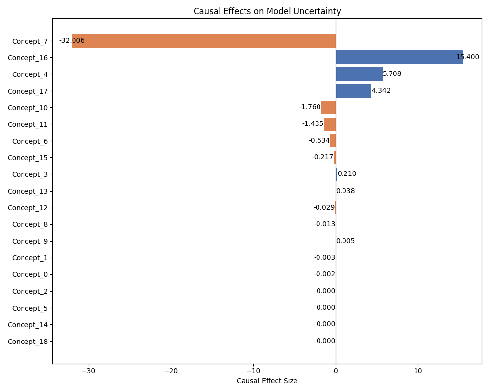

# Пример каузального объяснения на основе концептов

В этом документе представлено пошаговое руководство по скрипту `concept_explainer.py`, который демонстрирует использование класса `ConceptCausalExplainer` из библиотеки `applybn`. Скрипт показывает полный конвейер для извлечения концептов из данных, обучения предиктивной модели и оценки каузальных эффектов этих концептов на результаты модели, такие как уверенность и неопределенность.

## Обзор

Скрипт выполняет следующие ключевые шаги:

1.  **Загрузка и предварительная обработка данных**: загружает набор данных UCI Adult, выполняет очистку, one-hot кодирование для категориальных признаков и масштабирование для числовых признаков.
2.  **Создание экземпляра объяснителя**: создает экземпляр `ConceptCausalExplainer`.
3.  **Извлечение концептов**: использует объяснитель для обнаружения концептов в наборе данных.
4.  **Генерация пространства концептов**: преобразует исходное пространство признаков в пространство на основе концептов.
5.  **Обучение предиктивной модели**: обучается классификатор Random Forest на исходных признаках.
6.  **Расчет уверенности и неопределенности**: вычисляются уверенность и неопределенность модели.
7.  **Оценка каузальных эффектов**: оценивается каузальное влияние обнаруженных концептов на уверенность и неопределенность модели.
8.  **Визуализация результатов**: генерируются диаграммы "торнадо" для визуализации этих каузальных эффектов.
9.  **Извлечение значений концептов**: скрипт определяет исходные признаки, которые наиболее репрезентативны для каждого обнаруженного концепта.

## 1. Настройка и импорт

Сначала мы импортируем необходимые библиотеки. `pandas` используется для манипулирования данными, `sklearn` для задач машинного обучения (обучение модели, предварительная обработка и разделение данных), а `ConceptCausalExplainer` — это основной класс из нашей библиотеки.

```python
import pandas as pd
from rich import print as rprint # для красивого вывода
from sklearn.ensemble import RandomForestClassifier
from sklearn.model_selection import train_test_split
from sklearn.preprocessing import OneHotEncoder, StandardScaler

# Основной класс для каузального объяснения на основе концептов
from applybn.explainable.causal_analysis import ConceptCausalExplainer
```

## 2. Загрузка и предварительная обработка данных

Функция `load_and_preprocess_data` обрабатывает получение набора данных UCI Adult, который является распространенным эталонным набором данных для задач классификации.

```python
def load_and_preprocess_data():
    """Загрузка и предварительная обработка набора данных UCI Adult.

    Возвращает:
        tuple: (X_processed, y, X_original), где:
            X_processed (pd.DataFrame): обработанные признаки, готовые для моделирования.
            y (pd.Series): бинарные метки (доход >50K или <=50K).
            X_original (pd.DataFrame): исходные признаки до кодирования/масштабирования.
    """
    # URL для набора данных UCI Adult
    url = "https://archive.ics.uci.edu/ml/machine-learning-databases/adult/adult.data"
    # Определение имен столбцов согласно описанию набора данных
    column_names = [
        "age", "workclass", "fnlwgt", "education", "education-num",
        "marital-status", "occupation", "relationship", "race", "sex",
        "capital-gain", "capital-loss", "hours-per-week", "native-country", "income",
    ]
    # Чтение данных, рассматривая ' ?' как значения NaN
    data = pd.read_csv(url, names=column_names, header=None, na_values=" ?")

    # Удаление строк с любыми пропущенными значениями
    data.dropna(inplace=True)
    # Сброс индекса DataFrame после удаления строк
    data.reset_index(drop=True, inplace=True)

    # Разделение признаков (X) и целевой переменной (y)
    # X_original хранит признаки до любого преобразования, что полезно для интерпретации концептов позже
    X_original = data.drop("income", axis=1).reset_index(drop=True)
    # Преобразование столбца дохода в бинарные метки (1, если >50K, иначе 0)
    y = (
        data["income"]
        .apply(lambda x: 1 if x.strip() == ">50K" else 0)
        .reset_index(drop=True)
    )

    # Определение категориальных столбцов для one-hot кодирования
    categorical_cols = X_original.select_dtypes(include=["object"]).columns
    # Инициализация OneHotEncoder:
    # - sparse_output=False означает, что он возвращает плотный массив
    # - handle_unknown='ignore' означает, что если во время преобразования встречается неизвестная категория, она игнорируется
    encoder = OneHotEncoder(sparse_output=False, handle_unknown="ignore")
    # Применение one-hot кодирования
    X_encoded = pd.DataFrame(
        encoder.fit_transform(X_original[categorical_cols]),
        columns=encoder.get_feature_names_out(categorical_cols),
    )
    
    # Отделение числовых столбцов
    X_numeric = X_original.select_dtypes(exclude=["object"]).reset_index(drop=True)
    # Объединение числовых признаков с новыми one-hot закодированными признаками
    X_processed = pd.concat(
        [X_numeric.reset_index(drop=True), X_encoded.reset_index(drop=True)], axis=1
    )

    # Определение числовых столбцов для масштабирования
    numeric_cols_to_scale = X_numeric.columns # Примечание: они из исходного X_numeric, а не X_original
    # Инициализация StandardScaler для стандартизации признаков путем удаления среднего и масштабирования до единичной дисперсии
    scaler = StandardScaler()
    # Применение масштабирования к числовым столбцам в обработанном наборе признаков
    X_processed[numeric_cols_to_scale] = scaler.fit_transform(X_processed[numeric_cols_to_scale])
    # Сброс индекса полностью обработанного набора данных
    X_processed.reset_index(drop=True, inplace=True)

    return X_processed, y, X_original
```

## 3. Основной блок выполнения

Функция `main` организует весь процесс объяснения.

```python
def main():
    """Демонстрация использования CausalModelExplainer на примере набора данных."""
    # Шаг 1: Загрузка и предварительная обработка данных
    X, y, original_X = load_and_preprocess_data()

    # Шаг 2: Создание наборов данных для обнаружения (D) и естественного (N)
    # Набор данных разделяется на набор для 'обнаружения' (D), используемый для извлечения концептов,
    # и 'естественный' набор (N), который может использоваться для других целей (например, для проверки, хотя здесь это явно не делается).
    # shuffle=False используется для сохранения исходного порядка при необходимости, хотя random_state обеспечивает воспроизводимость.
    D, N = train_test_split(X, test_size=0.3, random_state=42, shuffle=False)
    # Сброс индексов для D и N, чтобы убедиться, что они чистые и начинаются с 0.
    # drop=False сохраняет старый индекс как новый столбец, что может быть полезно для отслеживания.
    D.reset_index(drop=False, inplace=True)
    N.reset_index(drop=False, inplace=True)

    # Шаг 3: Создание экземпляра объяснителя
    # Это создает объект нашего класса ConceptCausalExplainer.
    explainer = ConceptCausalExplainer()

    # Шаг 4: Извлечение концептов
    # Метод extract_concepts анализирует набор данных для обнаружения (D) и естественный набор данных (N)
    # для выявления значимых кластеров точек данных, которые затем рассматриваются как концепты.
    cluster_concepts = explainer.extract_concepts(D, N)
    rprint(f"Обнаруженные концепты (назначения кластеров): {cluster_concepts}")

    # Шаг 5: Генерация пространства концептов
    # Метод generate_concept_space преобразует исходное пространство признаков (X)
    # в новое пространство (A), где каждое измерение может представлять обнаруженный концепт.
    # Обычно это включает присвоение каждой точки данных в X одному или нескольким концептам.
    A = explainer.generate_concept_space(X, cluster_concepts)
    rprint(f"Пространство концептов A:\n{A.head()}")

    # Шаг 6: Обучение предиктивной модели
    # Для демонстрации обучается RandomForestClassifier на исходных обработанных признаках (X) и метках (y).
    # Предсказания этой модели будут проанализированы на уверенность и неопределенность.
    predictive_model = RandomForestClassifier(n_estimators=100, random_state=42)
    predictive_model.fit(X, y)

    # Шаг 7: Расчет уверенности и неопределенности
    # Метод calculate_confidence_uncertainty использует обученную модель
    # для определения ее уверенности и неопределенности для каждого предсказания на наборе данных X.
    confidence, uncertainty = explainer.calculate_confidence_uncertainty(
        X, y, predictive_model
    )
    rprint(f"Рассчитанная уверенность (первые 5): {confidence[:5]}")
    rprint(f"Рассчитанная неопределенность (первые 5): {uncertainty[:5]}")

    # Шаг 8: Подготовка данных для оценки каузального эффекта
    # Создаются копии данных пространства концептов (A) и добавляются рассчитанные уверенность и неопределенность в качестве новых столбцов.
    # Они будут служить выходными переменными для оценки каузального эффекта.
    D_c_confidence = A.copy()
    D_c_confidence["confidence"] = confidence # Добавление уверенности в качестве столбца

    D_c_uncertainty = A.copy()
    D_c_uncertainty["uncertainty"] = uncertainty # Добавление неопределенности в качестве столбца

    # Шаг 9: Оценка каузальных эффектов
    # Метод estimate_causal_effects_on_continuous_outcomes вызывается дважды:
    # один раз для уверенности и один раз для неопределенности. Он оценивает, как изменения в
    # наличии или активации концептов влияют на эти непрерывные результаты.
    effects_confidence = explainer.estimate_causal_effects_on_continuous_outcomes(
        D_c_confidence, outcome_name="confidence"
    )
    rprint(f"Каузальные эффекты на уверенность:\n{effects_confidence}")

    effects_uncertainty = explainer.estimate_causal_effects_on_continuous_outcomes(
        D_c_uncertainty, outcome_name="uncertainty"
    )
    rprint(f"Каузальные эффекты на неопределенность:\n{effects_uncertainty}")

    # Шаг 10: Генерация визуализаций
    # Диаграммы "торнадо" используются для визуализации оцененных каузальных эффектов.
    # Эти диаграммы показывают относительную важность и направление влияния каждого концепта на результат.
    explainer.plot_tornado(
        effects_confidence, title="Каузальные эффекты на уверенность модели", figsize=(10, 8)
    )

    explainer.plot_tornado(
        effects_uncertainty,
        title="Каузальные эффекты на неопределенность модели",
        figsize=(10, 8),
    )

    # Шаг 11: Извлечение и логирование значений концептов
    # Метод extract_concept_meanings помогает интерпретировать, что представляет собой каждый обнаруженный концепт
    # путем определения наиболее важных исходных признаков (из original_X) в каждом кластере концептов из набора данных D.
    selected_features_per_concept = explainer.extract_concept_meanings(
        D, cluster_concepts, original_X
    )
    # Результаты выводятся в консоль.
    rprint(f"\nДетали признаков концептов: {selected_features_per_concept}")

# Стандартная идиома Python для запуска основной функции при выполнении скрипта.
if __name__ == "__main__":
    main()
```




## Заключение

Этот пример скрипта демонстрирует комплексный рабочий процесс применения каузальных объяснений на основе концептов. Следуя этим шагам, пользователи могут получить представление о том, как абстрактные концепты, полученные из их данных, влияют на поведение и результаты их моделей машинного обучения. Визуализация каузальных эффектов и интерпретация значений концептов обеспечивают действенное понимание, выходящее за рамки стандартной важности признаков.

Не забудьте заменить пути к изображениям-заглушкам на фактические пути к вашим сгенерированным графикам.
