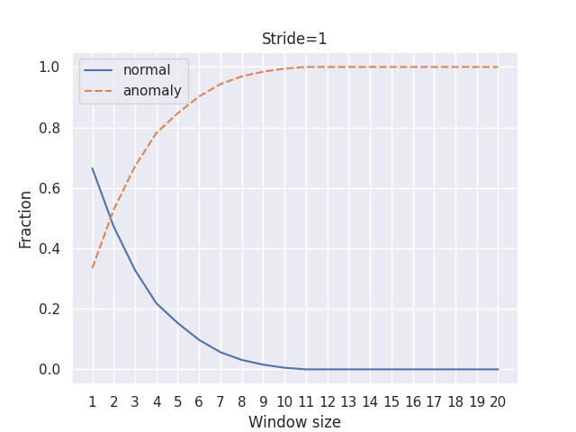

# Обнаружение аномалий во временных рядах

## Обзор

Обнаружение аномалий во временных данных требует тщательного баланса между чувствительностью и специфичностью, особенно при
реализации временных глубоких сетей доверия (tDBN). Эффективность этих моделей зависит от точной настройки
нескольких критических параметров:

Структурные параметры:

- num_parents: контролирует сложность сети (обычно 1-5)
- markov_lag: управляет диапазоном временной зависимости (обычно 1-3 шага) (значительно увеличивает время вычислений)
- Non_stationary: заставляет алгоритм вычислять матрицы `num_transition`. Если процесс стационарный,
требуется только одна матрица.

Параметры обработки:

- artificial_slicing: включает временной анализ на основе окон
- artificial_slicing_params: определяет характеристики размера окна и шага

Наш пример демонстрирует, что оптимальная производительность достигается не за счет максимальной сложности, а за счет стратегической
калибровки параметров. Особое внимание будет уделено искусственной нарезке.

Набор данных был взят отсюда [здесь](https://www.timeseriesclassification.com/description.php?Dataset=ECG200).

## Настройка

```python
import numpy as np

from applybn.anomaly_detection.dynamic_anomaly_detector.fast_time_series_detector import FastTimeSeriesDetector
from applybn.anomaly_detection.dynamic_anomaly_detector.data_formatter import TemporalDBNTransformer

import matplotlib.pyplot as plt
import pandas as pd
from tqdm import tqdm
import seaborn as sns
from pyts.approximation import SymbolicAggregateApproximation # не устанавливается по умолчанию
from sklearn.metrics import f1_score

sns.set_theme()

np.random.seed(51)
```

## Шаг 1. Загрузка данных
```python
df = pd.read_csv("data/anomaly_detection/ts/ECG200.csv")
df = df.loc[:, df.columns[1::3].tolist() + ["anomaly"]] # берем каждый 3-й шаг для ускорения вычислений
print(df.shape) # (200, 33)
```

## Шаг 2. Искусственная нарезка
Этот пример демонстрирует роль подходящих гиперпараметров для нарезки.

```python
y = df.pop("anomaly")

fracs_normal = []
fracs_anomaly = []
x = np.linspace(1, 20, 20).astype(int)
pbar = tqdm(x)

for i in pbar:
    pbar.set_description(f"Processing {i}")
    transformer = TemporalDBNTransformer(window=i, stride=i)
    df_ = transformer.transform(df, y)

    try:
        non_anom_frac = df_["anomaly"].value_counts(normalize=True)[0]
    except KeyError:
        non_anom_frac = 0
        
    fracs_normal.append(non_anom_frac)
    fracs_anomaly.append(1 - non_anom_frac)

final_df = pd.DataFrame({"normal": fracs_normal,
                         "anomaly": fracs_anomaly},
                        index=x)

ax = sns.lineplot(data=final_df)
ax.set(title="Stride=Window size", xlabel='Window size', ylabel='Fraction')
ax.set_xticks(x)
plt.show()
```


Поэтому очень важно сохранять баланс в целевом векторе.

## Шаг 3. Обработка данных
```python
transformer = TemporalDBNTransformer(window=5, stride=1)
df_ = transformer.transform(df, y)

y = df_.pop("anomaly")
```

## Шаг 4. SAX
```python
transformer = SymbolicAggregateApproximation()
sax_vals = transformer.transform(df_.iloc[:, 1:])
df_ = df_.astype(str)

df_.iloc[:, 1:] = sax_vals
```

## Шаг 5. Обнаружение

```python
detector = FastTimeSeriesDetector(markov_lag=1, num_parents=1)

detector.fit(df_)
detector.calibrate(y)
preds_cont = detector.predict(df_)

print(f1_score(y, preds_cont)) # 0.9171270718232044
```

## Вариации

```python
for i in range(2, 6, 2):
    df = pd.read_csv("data/anomaly_detection/ts/ECG200.csv")
    df = df.loc[:, df.columns[1::3].tolist() + ["anomaly"]]

    y = df.pop("anomaly")

    transformer = TemporalDBNTransformer(window=i, stride=1)
    df_ = transformer.transform(df, y)

    y = df_.pop("anomaly")

    transformer = SymbolicAggregateApproximation()
    sax_vals = transformer.transform(df_.iloc[:, 1:])
    df_ = df_.astype(str)

    df_.iloc[:, 1:] = sax_vals

    detector = FastTimeSeriesDetector(markov_lag=1,
                                      num_parents=1)
    detector.fit(df_)
    detector.calibrate(y, verbose=0)
    preds_cont = detector.predict(df_)
    print(i)
    print(f1_score(y, preds_cont))
    print("____")
```

Результат:
```
Evaluating network with LL score.
2
0.6907894736842105
____
Evaluating network with LL score.
4
0.8774928774928775
____
Evaluating network with LL score.
6
0.9487870619946092
____
```